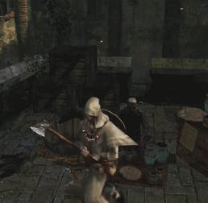
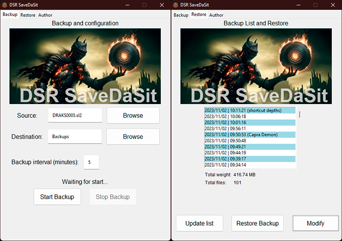

<h2 align="center">

  
DSR_SaveDaSit
</h2>

Ever wish there was an 'undo' button for that game mistake?" ⏪ 

Fed up with smacking innocent merchants in a plummeting capitalist society? 🤷‍♂️ 

<div align="center">
  
</div>

> _No merchant was harmed in the making of this gif, at least in our timeline._

This project is your savior!🚀 
An automation tool for Dark Souls Remastered backups, taking you back in time where your in-game sins don't exist. Time travel without the DeLorean! 🕒🔙

⚠️ **DISCLAIMER:** _You're doing this at your own risk, I am not responsible for any data loss or damage that may occur._

## 📚 Table of Contents

- [How](#-How)
- [Compile](#-Compile)
- [Contribute](#-Contribute)
- [FAQ](#-FAQ)
- [License](#-License)

## 📖 How

1. **Execution Options**:
   - 🚀 Getting Started with the Executable
     1. 📥 Download the latest version from the [releases page](https://github.com/zkrvf/DSR_SaveDaSit/releases).
     2. 📦 Unzip the downloaded `.zip` file.
     3. 🖱️ Double-click to execute the program.

   - **Using the Python Script 🐍**:
     - 🚀 First, clone the repository:
       ```bash
       git clone https://github.com/zkrvf/DSR_SaveDaSit/
       cd DSR_SaveDaSit
       ```
     - 📋 Next, ensure you have all the dependencies resolved by installing them with:
       ```bash
       pip install -r requirements.txt
       ```
     - 🔥 Finally, run the script:
       ```bash
       python DSR_savedatsit.py
       ```

<div align="center">
  
</div>

## You'll find two main tabs: `Backup 📦` and `Restore 🔄`.
2. **Backup Tab 🔄**:
   - In the `Backup 📦` tab:
     - **Specify Save File Path 🗂️**: Add the path to the save file. By default, it's located at `%USERPROFILE%\Documents\NBGI\DARK SOULS REMASTERED\123456`.
     - **Select Backup Destination 📍**: Choose where you'd like the backups to be stored.
     - **Set Interval ⏲️**: Define how often you want to create a backup (e.g., every 10 minutes).
     - **Start/Stop ⏯️**: Once set, click on `Start Backup 🟢`. You can stop it whenever you wish.

4. **Restore Tab ⏪**:
   - In the `Restore 🔄` tab, you'll find:
     - **Backup List 📜**: Displays all the backups made with brief details on their size and count.
     - **Buttons 🔘**:
       - `Update List 🔄`: Refreshes the backup list.
       - `Restore ⏪`: Allows you to restore from a selected backup.
       - `Modify ✏️`: Here, you can add a short descriptive text to your backup.

Happy gaming and safe saving! 🎮💾

## 🔧 Compile 🛠️
```bash
git clone https://github.com/zkrvf/DSR_SaveDatSit
cd DSR_SaveDatSit
pip install -r requirements.txt
pip install pyinstaller
pyinstaller DSR_SaveDatSit.spec
```

## ➕ Contribute 🤝

Steps or guidelines for those wishing to contribute to the project. It might look something like:

1. 🍴 Fork the project.
2. 🌱 Create a new branch (`git checkout -b my_new_branch`).
3. ✍️ Commit your changes (`git commit -am 'Add new feature'`).
4. 🚀 Push to the branch (`git push origin my_new_branch`).
5. 📬 Open a new Pull Request.

## ❓ FAQ (Frequently Asked Questions)
**Q:** Wait a minute, is this just a program that copies a file in a loop with a Dark Souls theme? Couldn't it work for any file?  
**A:** 👀

## 📝 License 📜
The software is licensed under the [GNU General Public License v3.0](https://www.gnu.org/licenses/gpl-3.0.en.html).
